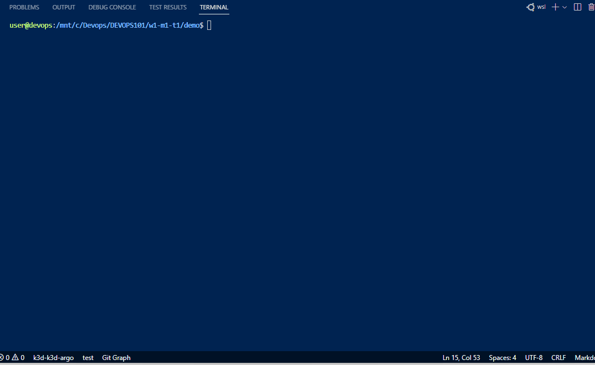

# Comparison of Kubernetes Cluster Deployment Tools

| Tool | Description | Pros | Cons | Demo |
| --- | --- | --- | --- | --- |
| Minikube | Minikube is a tool that makes it easy to run Kubernetes locally by creating a single-node cluster on your local machine. | - Easy to set up and use - Provides a consistent environment for development and testing - Supports many Kubernetes features | - Limited scalability - Can be resource-intensive - Requires manual configuration for some features | [Minikube Demo](https://minikube.sigs.k8s.io/docs/) |
| Kind | Kind (Kubernetes in Docker) is a tool for running local Kubernetes clusters using Docker container "nodes". | - Easy to set up and use - Supports multi-node clusters - Can be used with continuous integration (CI) tools - Supports many Kubernetes features | - Can be resource-intensive - Not recommended for production use | [Kind Demo](https://kind.sigs.k8s.io/docs/user/quick-start/) |
| K3d | K3d is a lightweight tool for running Kubernetes clusters using Docker container "nodes". | - Lightweight and fast - Supports multi-node clusters - Supports many Kubernetes features - Can be used with continuous integration (CI) tools | - Not recommended for production use | [K3d Demo](https://k3d.io/#getting-started) |

### Demo

#### Minikube

1. Install minikube using the official documentation
2. Start minikube using the `minikube start` command
3. Verify that the cluster is running using the `kubectl cluster-info` command
4. Deploy an example application using `kubectl create deployment` and `kubectl expose deployment` commands
5. Access the application using the `minikube service` command

#### kind

1. Install kind using the official documentation
2. Create a Kubernetes cluster using kind using the `kind create cluster` command
3. Verify that the cluster is running using the `kubectl cluster-info` command
4. Deploy an example application using `kubectl create deployment` and `kubectl expose deployment` commands
5. Access the application using the `kubectl port-forward` command or `kubectl proxy` command

#### k3d

1. Install k3d using the official documentation
2. Create a Kubernetes cluster using k3d using the `k3d create cluster` command
3. Verify that the cluster is running using the `kubectl cluster-info` command
4. Deploy an example application using `kubectl create deployment` and `kubectl expose deployment` commands
5. Access the application using the `kubectl port-forward` command or `kubectl proxy` command

