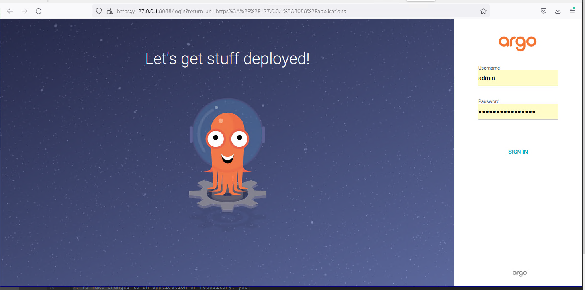
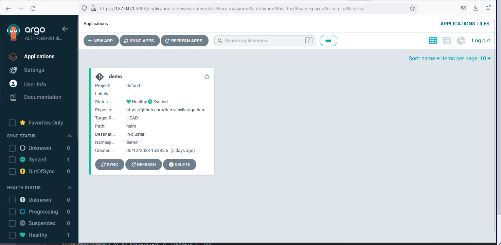
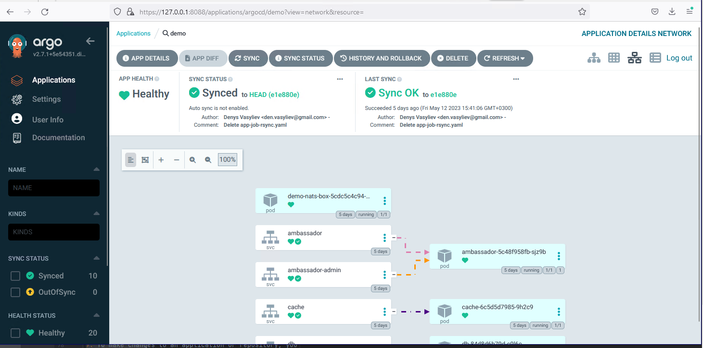
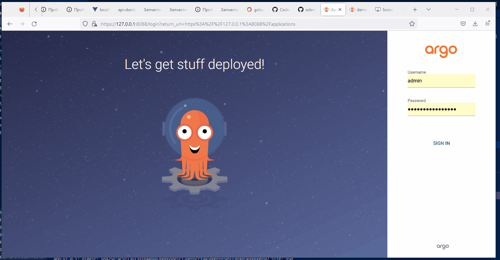

# Installing and Configuring Command Access to the ArgoCD Graphical Interface in Kubernetes Cluster k3d

## Prerequisites

- k3d installed on your local machine
- kubectl installed on your local machine

## Installation

1. Create a k3d cluster by running the following command:

   ```
   k3d cluster create my-cluster
   ```

2. Install the ArgoCD by running the following command:

   ```
    kubectl create namespace argocd
    kubectl apply -n argocd -f https://raw.githubusercontent.com/argoproj/argo-cd/stable/manifests/install.yaml

   ```

3. Wait for the ArgoCD deployment to complete.

4. To access the ArgoCD web interface, run the following command to expose the service:

   ```
   kubectl port-forward svc/argocd-server -n argocd 8088:443
   ```

5. Open a web browser and navigate to `https://localhost:8080`. You should now be able to access the ArgoCD graphical interface.

## Configuring Command Access

1. Install the ArgoCD command-line tool by running the following command in your terminal:

   ```
   brew install argocd
   ```

2. Once the installation is complete, configure the ArgoCD command-line tool to connect to your ArgoCD server by running the following command:

   ```
   argocd login localhost:8080 --insecure --username <ARGOCD_USERNAME> --password <ARGOCD_PASSWORD>
   ```

   Replace `<ARGOCD_USERNAME>` and `<ARGOCD_PASSWORD>` with your ArgoCD credentials.

3. You should now have command-line access to your ArgoCD server. You can use the `argocd` command to perform various tasks, such as syncing applications or viewing their status.

4. If you forgot password, you can use that command to retrieve your password:

   ```
   argoPass=$(kubectl -n argocd get secret argocd-initial-admin-secret -o jsonpath="{.data.password}" | base64 -d)
   echo $argoPass
   ```

## Accessing the ArgoCD Interface






1. Open a web browser and navigate to the ArgoCD URL.

2. On the login screen, enter your username and password and click "Login".

3. Once logged in, you will be directed to the ArgoCD dashboard.

4. In the dashboard, you can view the status of your applications and repositories, as well as manage your clusters, settings, and user accounts.

5. To view the details of a specific application or repository, click on its name in the dashboard.

6. From the application or repository details page, you can view its current state, configuration, and deployment history.

7. To make changes to an application or repository, you can use the ArgoCD interface to modify its configuration, sync its state, or trigger a deployment.

8. If you encounter any issues while using the ArgoCD interface or command-line tool, you can refer to the ArgoCD documentation or contact your administrator for assistance.

Note: The ArgoCD installation and configuration process may differ depending on your setup and environment.